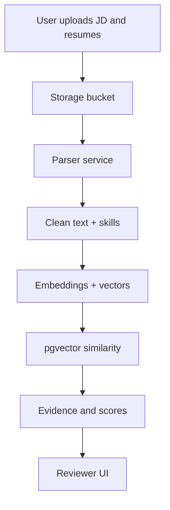

# EvidenceHire Architecture

## Default stack

- Frontend: Next.js App Router
- API: Next.js route handlers
- Database: Supabase Postgres
- Storage: Supabase Storage
- Matching: pgvector embeddings + scoring service
- Hosting: Vercel

## Data flow

## Core services

- Parser: Extract text and normalize skills.
- Matching: Embed documents, compute similarity, and generate evidence.
- Reviewer: Summarize top evidence and gaps for each candidate.

## Security and privacy

- Store resumes encrypted at rest with strict access controls.
- Log all scoring decisions with timestamps and evidence hashes.
- Provide data deletion and export for user control.
